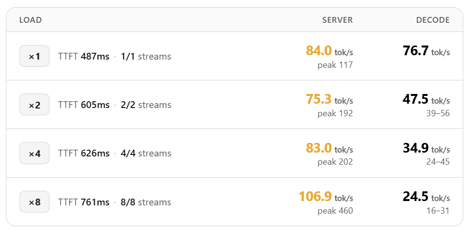

# Laguna-S-2.1-NVFP4 · vLLM Serving

Serves **[poolside/Laguna-S-2.1-NVFP4](https://huggingface.co/poolside/Laguna-S-2.1-NVFP4)** — a 117.6B-parameter MoE model with NVFP4 quantization (~71 GB) — accelerated by **DFlash speculative decoding** via its paired draft model [`poolside/Laguna-S-2.1-DFlash-NVFP4`](https://huggingface.co/poolside/Laguna-S-2.1-DFlash-NVFP4).

Runs in Docker on **vLLM 0.25.1**. Designed for the **DGX Spark (NVIDIA GB10, sm_121a)**.

---

## Hardware Requirements

| Component | Requirement |
|---|---|
| **GPU** | NVIDIA GB10 (DGX Spark) — architecture `sm_121a` |
| **Memory** | 128 GB unified (weight footprint ≈71 GB target + ≈2 GB draft) |
| **Storage** | ~150 GB free for model cache (`~/.cache/huggingface/hub`) |
| **Architecture** | `aarch64` (ARM64) |

---

## Prerequisites

- **Docker** with NVIDIA container toolkit (`nvidia-ctk` installed and configured)
- **curl**
- **HuggingFace CLI** (*optional* — for faster model downloads):
  ```bash
  pip install huggingface-cli
  ```
  or the newer `hf` tool:
  ```bash
  pip install huggingface-hub
  ```
- **HuggingFace token** with access to [poolside/Laguna-S-2.1-NVFP4](https://huggingface.co/poolside/Laguna-S-2.1-NVFP4) (set `HF_TOKEN` if the model is gated)

---

## Quick Start

```bash
# 1. Download both models (one-time, ~150 GB total)
export HF_TOKEN="hf_..."   # only if the model is gated
./start.sh --download-only

# 2. Start the server
./start.sh

# 3. Stop the server
./stop.sh
```

On first start the server takes ≈**15 minutes** to become ready (weight load from NVMe, FlashInfer JIT kernel compilation, and CUDA graph capture). Subsequent starts are faster if the HuggingFace cache is preserved.

---

## Scripts

### `start.sh`

Launches or manages the vLLM serving container.

```bash
./start.sh                         # download if needed → start server
./start.sh --download-only         # download models only, then exit
./start.sh -h                      # show help
```

**What it does:**

1. Checks `~/.cache/huggingface/hub` for both models; downloads any that are missing (using `hf` → `huggingface-cli` → Docker fallback)
2. Removes any stale container named `laguna-s-2.1-nvfp4`
3. Pulls the Docker image (`vllm/vllm-openai:v0.25.1`)
4. Starts the container with a bootstrap script that installs `flashinfer-python` (if not already in the image) for FP4 kernel support
5. Waits for the `/v1/models` endpoint to return HTTP 200
6. Prints the OpenAI-compatible base URL

### `stop.sh`

Stops and removes the container.

```bash
./stop.sh
```

---

## API Endpoint

Once running, the server exposes an **OpenAI-compatible API**:

```
http://localhost:8888/v1
```

### Example

```bash
curl http://localhost:8888/v1/chat/completions \
  -H "Content-Type: application/json" \
  -d '{
    "model": "poolside/Laguna-S-2.1-NVFP4",
    "messages": [
      {"role": "user", "content": "Write a quick sort in Python."}
    ]
  }'
```

---

## Configuration

### Models

| Variable | Default | Description |
|---|---|---|
| `MODEL_ID` | `poolside/Laguna-S-2.1-NVFP4` | Target (main) model |
| `DRAFT_MODEL_ID` | `poolside/Laguna-S-2.1-DFlash-NVFP4` | DFlash speculative draft model |

### Serving

| Flag | Value | Notes |
|---|---|---|
| `--host` / `--port` | `0.0.0.0:8888` | |
| `--tensor-parallel-size` | `1` | Single GPU (GB10) |
| `--gpu-memory-utilization` | `0.85` | Leaves margin for JIT + graph capture |
| `--max-model-len` | `262144` | 256K context window |
| `--max-num-seqs` | `4` | **Required** — DFlash crashes at the default of 256; 4 is a safe starting point for single-user use |
| `--enable-auto-tool-choice` | | Structured output / tool calling |
| `--tool-call-parser` | `poolside_v1` | |
| `--reasoning-parser` | `poolside_v1` | |
| `--override-generation-config` | `{"temperature":0.7,"top_p":0.95}` | Recommended sampling defaults; many clients send none |
| `--speculative-config` | `{"model":"poolside/Laguna-S-2.1-DFlash-NVFP4","num_speculative_tokens":15,"method":"dflash"}` | DFlash with 15 speculative tokens |

> **Do not** add `--linear-backend flashinfer_b12x` — it is broken on vLLM 0.25.1 and slower than auto-selected FlashInferCutlass.
>
> **Do not** include `min_p` in `--override-generation-config` — vLLM rejects it under speculative decoding (400 error on every request).

### Environment Variables

| Variable | Default | Description |
|---|---|---|
| `HF_TOKEN` | *(empty)* | HuggingFace token for gated models |
| `IMAGE` | `vllm/vllm-openai:v0.25.1` | Docker image override |
| `MAX_JOBS` | `4` | Cap for JIT compilation fan-out (prevents OOM on cold cache) |

---

## First Start (≈15 Minutes)

The first launch includes:

1. **Weight loading** — 66.98 GB of NVFP4 weights from disk
2. **JIT compilation** — FlashInfer autotuner profiles ~21 CUDA kernels for `sm_121a`
3. **CUDA graph capture** — Optimizes small-batch execution paths

You will see log output like:

```
[APIServer pid=1] WARNING ... registry.py ... LagunaForCausalLM  (harmless, resolved by --trust-remote-code)
[EngineCore pid=...] Available KV cache memory: 32.44 GiB
[EngineCore pid=...] flashinfer.jit: [Autotuner]: Skipped 10 unsupported tactic(s) ...
```

The autotuner progress bar (`7/21 [00:03<00:10, 1.40profile/s]`) is normal.

### KV Cache

| Metric | Value |
|---|---|
| Available KV cache | **~32.44 GB** |
| KV cache dtype | **FP8** (`torch.float8_e4m3fn`) — auto-selected by FlashInfer |
| GPU memory utilization | 85 % (effective ≈84.4 % with CUDA graph profiling) |
| Concurrent sequences | 4 max |

---

## Performance

Decode throughput with DFlash speculative decoding (15 speculative tokens) on DGX Spark (GB10):



---

## Running on RTX 6000 PRO (Blackwell, 96 GB)

The recipe works on an RTX 6000 PRO with a few changes:

| Setting | DGX Spark (GB10) | RTX 6000 PRO |
|---|---|---|
| **Architecture** | `aarch64` | `x86_64` (native Docker support) |
| **GPU arch** | `sm_121a` | `sm_120` (Blackwell) |
| **VRAM** | 128 GB unified | **96 GB GDDR7** |
| `CUTE_DSL_ARCH` | `sm_121a` | Needs Blackwell sm value (e.g. `sm_120`) |
| `--gpu-memory-utilization` | `0.85` | Start at **`0.78`** — model ~71 GB + draft + KV cache leaves less headroom on 96 GB |
| `--max-num-seqs` | `4` | Can likely be raised (start at 8, tune up) |

The Docker image `vllm/vllm-openai:v0.25.1` has x86_64 builds and works on Blackwell without modification. Set `CUTE_DSL_ARCH` to the correct Blackwell compute capability before starting.

---

## Troubleshooting

| Symptom | Likely Cause | Fix |
|---|---|---|
| `Error in inspecting model architecture 'LagunaForCausalLM'` | Registry subprocess missing `--trust-remote-code` | Set `-e VLLM_TRUST_REMOTE_CODE=1` (already in the Docker run) |
| `flashinfer-python==0.6.15.dev20260712` not found | Nightly not published on that date | Falls back to PyPI stable automatically |
| Container exits with `OOM` | JIT fan-out too large | Set `MAX_JOBS=2` or `MAX_JOBS=1` |
| `docker: Conflict` error | Stale container | Run `./stop.sh` or `docker rm -f laguna-s-2.1-nvfp4` |
| Slow first start | JIT + graph capture | Normal; takes ≈15 minutes |

---

## References

- [Poolside Laguna-S-2.1-NVFP4](https://huggingface.co/poolside/Laguna-S-2.1-NVFP4)
- [Poolside Laguna-S-2.1-DFlash-NVFP4](https://huggingface.co/poolside/Laguna-S-2.1-DFlash-NVFP4)
- [vLLM](https://github.com/vllm-project/vllm)
- [FlashInfer](https://github.com/flashinfer-ai/flashinfer)
